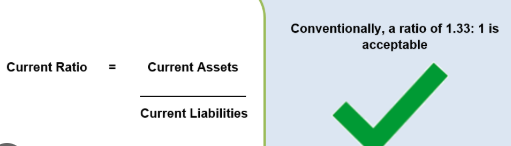
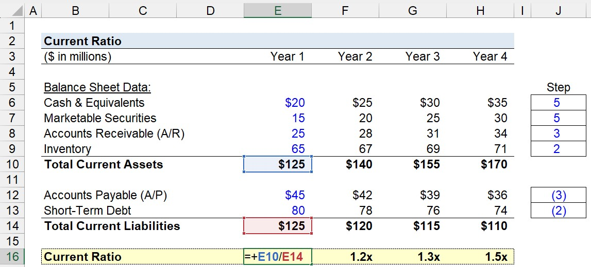
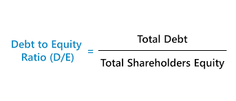
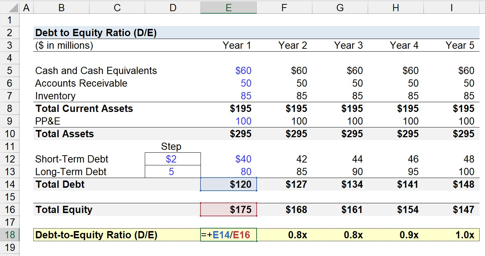
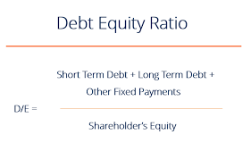

### **2. Financial Statements and Documents (45 minutes)**

#### Key Financial Documents:

* **Balance Sheet**

  * Structure: Assets, Liabilities, Equity
  * Key Ratios: Current Ratio, Debt-to-Equity Ratio
* **Income Statement**

  * Revenue, Expenses, Net Income
  * Profit margins and trends
* **Cash Flow Statement**

  * Cash from operations, investing, financing
  * Cash flow vs. profitability

#### Activities:

* Interpretation of a sample company's financials
* Identify patterns and financial performance

- Balance sheet : https://www.investopedia.com/terms/b/balancesheet.asp
- What is current ratio : 
    - current ratio is the ratio of current assets to current liabilities
    - 
    - 
- Liquidity Ratio
    - https://www.youtube.com/watch?v=bmZVPks4yQg

- Dept to equity ratio
    - 
    - 
    - 

- What is profit margin
    - profit margin is the ratio of net income to revenue
    - https://www.youtube.com/watch?app=desktop&v=uYM2YnwO-20